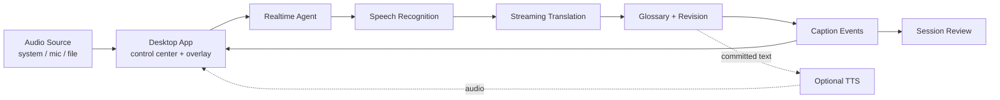

<div align="center">
  
  <h1>EchoSync</h1>
  <p><strong>面向单向音频流的 AI 实时同声传译助手。</strong></p>
  <p>
    <strong>EchoSync</strong> 是一个面向视频、网课、会议、演讲和技术分享场景的桌面同传工作台。
    它把系统声音采集、实时语音识别、流式翻译、术语约束、字幕修订、
    可选语音播报和会话复盘串成一条完整的同传体验。
  </p>
  <p>
    
    =20.19" src="https://img.shields.io/badge/Node.js-%3E%3D20.19-339933?style=flat-square&logo=node.js" />
    =3.11" src="https://img.shields.io/badge/Python-%3E%3D3.11-3776AB?style=flat-square&logo=python" />
    
    
  </p>
  <p>
    <a href="#快速开始"><strong>快速开始</strong></a>
    ·
    <a href="#项目亮点"><strong>项目亮点</strong></a>
    ·
    <a href="https://space.bilibili.com/451552520?spm_id_from=333.1007.0.0"><strong>项目介绍视频</strong></a>
    ·
    <a href="#核心工作流"><strong>核心工作流</strong></a>
    ·
    <a href="#技术方案"><strong>技术方案</strong></a>
    ·
    <a href="#项目状态"><strong>项目状态</strong></a>
  </p>
  <p><sub>Realtime Caption · Streaming ASR · Simultaneous Translation · Glossary · Overlay · Session Review</sub></p>
</div>

> EchoSync 的目标不是简单地把音频交给模型翻译，而是把外语音频变成能实时看、能修订、能回放、能沉淀术语的同传工作台。

| 音频采集底座 | 实时同传链路 | 桌面工作台 |
| --- | --- | --- |
| 支持系统声音、麦克风和文件音频入口，并具备自身播报音频隔离设计 | 多源实时 ASR + 流式翻译 + 术语约束 + 字幕修订 | 桌面控制中心、透明置顶字幕窗、会话复盘、可选语音播报 |

## 简介

EchoSync 面向“单向音频流理解”场景：当用户观看英文直播、网课、会议或技术分享时，它可以把正在播放的声音实时转成中文字幕，并在上下文变清楚后对前文进行修订，让听不懂的内容变成可读、可追踪、可复盘的信息流。

项目当前已经支持桌面同传主链路：

- 采集系统声音、麦克风或文件音频
- 将实时音频送入 Python Agent
- 编排语音识别、翻译、术语约束和字幕修订
- 在透明置顶悬浮窗中展示实时字幕
- 会话结束后保留音频和双语片段，用于回放、整理和复盘

一句话说，EchoSync 想把“实时字幕翻译”升级成“可长期使用的 AI 同传工作台”。

## 项目亮点

- 桌面级同传体验：主控窗口负责会话控制，透明置顶字幕窗覆盖在会议、播放器或浏览器之上。
- 系统声采集隔离：支持 Windows 系统声音采集，并设计了避免自身语音播报被重复识别的安全机制。
- 低延迟实时字幕：音频流、ASR、翻译和字幕展示采用事件驱动链路，字幕可以边识别边更新。
- 上下文修订能力：字幕不是一次性输出，而是允许在后续上下文到来后进行补丁式修订。
- 多模型扩展：ASR、翻译和 TTS 都通过抽象接口接入，便于切换本地模型、云端模型或端到端语音翻译能力。
- 术语约束：通过术语表控制专业词汇译法，适合技术分享、课程、论文讲解和行业会议。
- 会话复盘：同传结束后可以查看双语片段、回放原始音频，并为后续摘要和知识整理提供基础。
- 中文优先：产品文档、业务注释和配置说明面向中文用户和中文开发协作场景。

## 核心工作流

1. 打开 EchoSync 桌面端，选择系统声音、麦克风或文件音频。
2. 启动同传会话，桌面端完成音频采集和基础可用性检查。
3. Python Agent 接收实时音频流，并调用语音识别能力生成源文。
4. 稳定文本片段进入流式翻译，并结合术语表输出译文。
5. 字幕窗展示双语、主字幕或翻译字幕，并根据后续上下文进行修订。
6. 如果开启语音播报，系统会在字幕链路之外合成译文音频，避免阻塞字幕显示。
7. 会话结束后进入复盘视图，保留双语片段和音频回放能力。

## 技术方案



核心设计采用依赖倒置：实时管道只依赖 `Transcriber`、`Translator`、`CorrectionEngine`、`SubtitleSink`、`TtsSynthesizer` 等抽象接口，而不是直接绑定某个供应商 SDK。这样可以在不改动主链路的前提下接入不同 ASR、翻译、TTS 或端到端语音翻译模型。

## 技术栈

- `Electron`
- `Vite`
- `React`
- `Next.js`
- `TypeScript`
- `Python`
- `FastAPI / WebSocket`
- `Rust / WASAPI`
- `FunASR / Voxtral / Deepgram / Qwen Realtime`
- `DeepSeek / OpenAI-compatible API`
- `edge-tts / ElevenLabs`

## 快速开始

### 环境要求

- Windows 10/11
- Node.js `>=20.19.0 <25`
- Python `>=3.11`
- Rust toolchain

### 安装依赖

```powershell
npm install
```

Python Agent 请使用项目内 `.venv`。更完整的环境配置见 [doc/agent-env.md](doc/agent-env.md)。

### 启动桌面端

1. 启动 Python Agent

```powershell
cd apps/agent
python -m echosync_agent.transport.caption_ws
```

2. 另开一个终端启动桌面端

```powershell
npm run dev:desktop
```

3. 在桌面端选择音频源，打开会议、视频或网课音频，点击“开始同传”。

## 配置说明

项目通过 `.env.example` 提供配置模板。比赛演示或本地运行时，通常只需要按所选模型能力填写对应 API key 和 provider 配置。

常见配置类别：

| 配置类别 | 用途 |
|---|---|
| ASR provider | 选择本地或云端实时语音识别能力。 |
| Translation provider | 选择流式翻译模型或兼容 OpenAI API 的翻译服务。 |
| Glossary | 配置术语表开关、术语域和术语文件路径。 |
| TTS provider | 配置可选译文语音播报能力。 |
| Session summary | 配置会话复盘摘要所使用的模型能力。 |

## 字幕事件模型

EchoSync 的实时字幕不是等待整句结束后一次性显示，而是按 hypothesis 模型逐步推进：

```text
AudioFrame
  -> transcript.partial      # 源文草稿，持续吐字
  -> stable checkpoint       # 可翻译检查点
  -> translation.partial     # 流式译文，允许尾部修订
  -> translation.patch       # 上下文修正补丁
  -> segment.commit          # 最终锁定片段
```

这种事件模型可以同时兼顾实时性和可修订性：用户能尽早看到字幕，也能在上下文补全后获得更准确的译文。

## 术语表

术语表用于控制专业词汇译法，适合技术课程、论文分享、行业会议等场景。默认术语文件位于 `apps/agent/terms/`。

```csv
source,target,aliases,category,case_sensitive,match_mode,priority,constraint
LiveKit,LiveKit,,brand,true,literal,10,required
GPT-4o,GPT-4o,"GPT 4o|gpt4o",model,false,literal,10,required
latency,延迟,,tech,false,word,5,preferred
simultaneous interpretation,同声传译,,translation,false,phrase,8,required
```

可以为不同场景创建独立术语域，例如技术分享、课程、论文或产品发布会。术语表加载失败不会中断实时链路。

## 仓库结构

```text
apps/
  desktop/        # Electron 主控窗口、悬浮字幕窗、桌面音频入口
  web/            # Next.js 听译工作台和字幕交互原型
  agent/          # Python 实时 Agent、模型适配和同传管道
  wasapi-sidecar/ # Windows 系统声音采集 sidecar
doc/              # 产品、架构、UI、音频链路和环境配置文档
docs/             # 规划和开发过程文档
package.json      # monorepo 常用脚本
```
