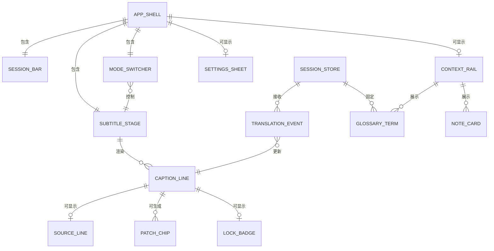
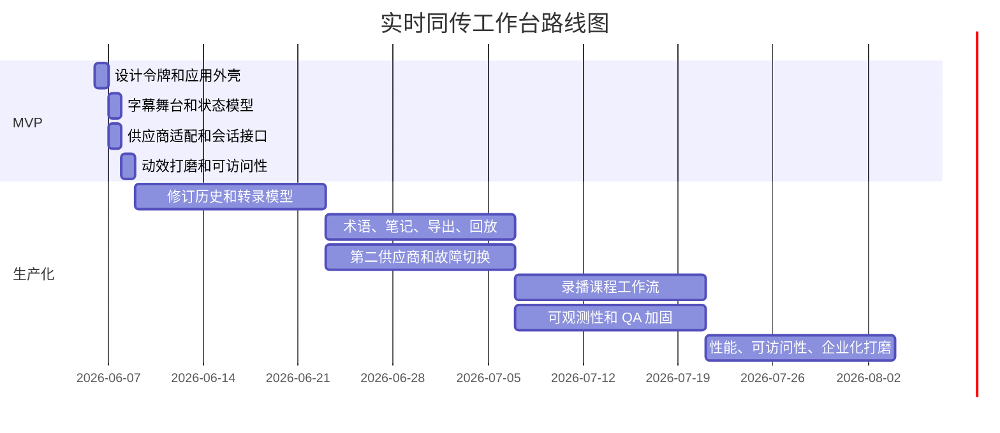

# AI 同声传译工作台 UI 设计调研

## 执行摘要

面向桌面和 Web 的 AI 同声传译工作台，不宜简单模仿会议软件，也不宜只做成浏览器插件。更合理的方向是内容优先的听译工作台：默认提供三栏工作台模式，并支持剧场模式、阅读模式和紧凑悬浮字幕。这样既能覆盖技术分享、会议直播、网课学习等高频场景，也能避免把产品做成一堆互相抢注意力的会议控件。

> 2026-06-06 收束说明：本文中的“供应商”“provider”等工作台线框属于早期调研语汇。当前 Desktop 产品实现以 `docs/superpowers/specs/2026-06-06-home-launcher-engine-settings-design.md` 为准：普通首页、字幕窗口和会议记录不展示模型/供应商，相关能力只进入偏好设置的高级入口。

核心判断如下：

- **字幕稳定性优先于花哨动效**。实时字幕持续更新，用户最怕的是整行文字反复跳动。界面应明确区分 `Interim`、`Stable`、`Revised`、`Locked` 四种状态。
- **模式切换是结构能力，不是装饰能力**。技术演讲需要源文、译文、术语和笔记共存；直播 keynote 需要大字号沉浸字幕；录播课程需要类似阅读器的句段回看。
- **动效只服务确定性变化**。实时字幕不应大幅位移；可以用局部高亮提示修订，用淡入淡出表达提交状态。
- **前端 MVP 应以 Next.js 工作台为主**。浏览器端音频捕获、字幕渲染和状态展示应先打磨好；Python/FastAPI 更适合后续录播处理、自托管 ASR、批处理修正和离线评估。

## 竞品模式观察

成熟产品并没有收敛到单一字幕形态，而是形成了一组可复用的交互模式：底部固定字幕、弹出字幕窗口、内容与字幕并排、自定义字幕样式、原文/译文切换、剧场模式、阅读模式和第二屏伴随窗口。

| 产品 | UI 做得好的地方 | EchoSync 可借鉴点 |
| --- | --- | --- |
| Zoom Translated Captions | 支持选择发言语言和字幕语言，字幕可放在底部，也支持样式和位置调整。 | 借鉴字幕自定义、原文加译文切换、内容与字幕并排。避免复制沉重的会议工具栏。 |
| Google Meet | 支持多种布局，如自动、平铺、聚焦和侧边栏；共享内容可放大。 | 借鉴明确的布局选择模型、浮动工具区、内容优先视图。 |
| Microsoft Teams | 支持实时翻译字幕、字幕样式调整、弹出字幕窗口。 | 借鉴可移动、可调整大小的独立字幕舞台，适合多屏或分屏工作。 |
| DeepL Voice | 将翻译体验做成伴随窗口，强调多语言字幕和会议连续性。 | 借鉴 companion surface 思路，让字幕工作台可以作为主屏或第二屏存在。 |
| Trancy | 明确区分剧场模式和阅读模式，阅读模式强调句子切分和学习辅助。 | 借鉴模式级信息架构，而不是只做视觉主题切换。 |
| Immersive Translate | 强调网页、文档、视频的一致双语阅读体验。 | 借鉴并排双语阅读面、仅译文模式、视频和文档体验一致性。 |

跨产品结论：

- **模式语义要清晰**：三栏工作台、剧场、阅读、紧凑悬浮分别服务不同场景。
- **字幕修订要克制**：只做局部短语补丁，避免整行替换造成阅读中断。
- **辅助面板不应压过字幕**：术语、笔记、历史可以折叠，字幕舞台始终是主角。

## 推荐体验架构

### 布局策略

桌面默认采用三栏工作台：左侧会话与输入控制，中间字幕主舞台，右侧源文、术语、笔记和历史。剧场模式用于高节奏直播或演讲，阅读模式用于录播课程和长内容复盘，紧凑悬浮模式用于分屏、多屏或覆盖在其他应用之上。

| 模式 | 适用场景 | 结构 | 优势 | 风险 | 建议 |
| --- | --- | --- | --- | --- | --- |
| 三栏工作台 | 技术分享、网课、讲座、长会议 | 左侧会话栏，中间字幕舞台，右侧上下文栏 | 信息密度高，适合术语和笔记 | 侧栏过重会像后台系统 | 桌面默认模式 |
| 剧场模式 | 直播、keynote、快节奏会议 | 中央大字幕，底部少量控制 | 沉浸、远距离可读 | 弱化笔记和术语检索 | 直播默认模式 |
| 阅读模式 | 录播课、复盘、学习 | 句段列表、时间线、较小音视频区 | 便于回看、摘录、对齐修订 | 不适合极快实时输入 | 录播默认模式 |
| 紧凑悬浮 | 多任务、第二屏、覆盖字幕 | 可移动小窗加极少控制 | 不打断主任务 | 上下文最少 | 作为工具模式 |

桌面工作台线框：

```text
┌─────────────────────────────────────────────────────────────────────────────┐
│ 顶栏：源语言 → 目标语言、延迟、供应商、术语表、模式、设置                  │
├───────────────┬──────────────────────────────────────────────┬──────────────┤
│ 会话栏        │ 实时字幕舞台                                 │ 上下文栏     │
│ - 开始/停止   │ [稳定中文字幕行]                              │ - 英文原文   │
│ - 输入源      │ [临时中文字幕行]                              │ - 术语       │
│ - 输出语音    │ [修订提示 / 已修订片段]                        │ - 笔记       │
│ - 历史        │ 波形 / 已用时间 / 锁定状态                     │ - 书签       │
├───────────────┴──────────────────────────────────────────────┴──────────────┤
│ 底部工具条：静音原声 / 译文语音 / 固定字幕 / 导出                          │
└─────────────────────────────────────────────────────────────────────────────┘
```

剧场模式线框：

```text
┌─────────────────────────────────────────────────────────────────────────────┐
│ 极简顶栏                                                                    │
│                                                                             │
│                      [大字号稳定中文字幕]                                   │
│                      [较小字号临时译文 / 原文]                              │
│                                                                             │
│                      轻量波形 / 置信度 / 延迟                               │
│                                                                             │
│ 底栏：译文语音 / 原声 / 双语 / 字号 / 固定                                  │
└─────────────────────────────────────────────────────────────────────────────┘
```

### 视觉系统

界面应借鉴 Apple 风格的克制、层级和材料纪律，而不是直接复制系统控件。字幕阅读面保持高对比、低干扰；半透明材质只用于顶栏、浮动面板和次要控制，不用于承载主字幕。

| 设计令牌 | 建议 |
| --- | --- |
| 字体 | 代码中使用 `system-ui, -apple-system, BlinkMacSystemFont, "Segoe UI", Inter, sans-serif`。桌面稳定字幕建议从 `32/40` 起步，临时字幕 `28/36`，元信息 `13/18`，原文 `16-18/24-28`。 |
| 图标 | 使用轻量线性图标，粗细与元信息文字匹配。 |
| 间距 | 使用 4 pt 微网格和 8 pt 布局节奏，大区块保留 24/32/40 间距。 |
| 圆角 | 卡片 10-14，浮动控制 18-22，胶囊控件 999。 |
| 材料 | 顶栏、浮层和设置面板可以半透明；主字幕面保持稳定底色。 |
| 阴影 | 只保留一到两个低对比层级，避免玻璃卡片堆叠。 |

字幕语义状态：

| 状态 | 视觉处理 |
| --- | --- |
| `Interim` | 前景透明度 70%-78%，字号略小，不写入历史。 |
| `Stable` | 满对比度显示，提交后不再持续动画。 |
| `Revised` | 只对变化短语做短暂高亮，随后回到稳定状态。 |
| `Locked` | 显示轻量锁定提示，不再接受自动修订。 |

### 响应式与可访问性

响应式策略应按模式设计，而不是只按断点裁剪：

- 大桌面：默认三栏工作台。
- 中等宽度：右侧上下文栏折叠为抽屉。
- 小笔记本或分屏：默认剧场模式，术语和笔记放入弹层。
- 窄屏：进入单列阅读模式或紧凑悬浮字幕。

可访问性要求：

- 主字幕必须满足高对比阅读要求，普通文字至少 4.5:1，大字号至少 3:1。
- 剧场模式中的所有设置仍应可键盘访问。
- 不要把每个临时 token 都发送给屏幕阅读器。可用 `role="status"` 只播报会话状态、已提交字幕和重要错误。
- 支持 `prefers-reduced-motion`，关闭位移和复杂转场，只保留透明度或颜色变化。

## 字幕状态与组件模型

### 状态模型

字幕状态应成为显式模型，而不是 UI 临时判断。供应商通常会提供中间结果和最终结果，前端应把它们映射为可读、可修订、可锁定的状态机。

| UI 状态 | 来源 | 视觉处理 | 修订策略 | 生命周期 |
| --- | --- | --- | --- | --- |
| `Interim` | ASR 或翻译的流式中间结果 | 弱强调，不写入历史 | 可完全替换 | 直到稳定边界出现 |
| `Stable` | 供应商 final 或稳定窗口提交 | 强强调，写入历史 | 允许短语级小修订 | 直到修订窗口过期 |
| `Revised` | 稳定行收到补丁 | 仅变化短语高亮 | 有界 patch | 极短时间后回到稳定 |
| `Locked` | 超时、段落边界、手动固定或导出 | 无动画，无 patch 高亮 | 不再自动修订 | 持久存在 |

推荐时序：

- `Interim -> Stable`：供应商 final、稳定前缀确认，或短暂 hold window 后提交。
- `Stable -> Revised`：只允许短语级、小范围变化。
- `Stable/Revised -> Locked`：句子或段落结束、超时、用户固定、导出时触发。

### 组件关系



### 组件规格

| 组件 | 关键属性 | 内部状态 | 事件 | 说明 |
| --- | --- | --- | --- | --- |
| `AppShell` | `mode`、`provider`、`sourceLang`、`targetLang`、`connected` | 布局、动效降级、主题 | `modeChanged`、`settingsOpened` | 负责响应式编排和面板持久化。 |
| `SessionBar` | `captureState`、`latencyMs`、`audioInput`、`audioOutput`、`provider` | 音量计、菜单开关 | `start`、`stop`、`muteOriginal`、`muteTranslated` | 保持轻薄，状态信息放这里，不挤占字幕面。 |
| `SubtitleStage` | `lines`、`showSource`、`showWaveform`、`maxLines`、`fontScale` | 视口测量、剧场锁定 | `lineCommitted`、`lineLocked`、`jumpToCurrent` | 性能关键组件。 |
| `CaptionLine` | `id`、`targetText`、`sourceText`、`state`、`confidence`、`startMs`、`endMs`、`patches` | 悬停、焦点、显隐 | `patchApplied`、`copyLine`、`lockLine`、`bookmarkLine` | 文本选择和复制应是一等能力。 |
| `PatchChip` | `prev`、`next`、`atMs`、`reason` | 展开/收起 | `accept`、`dismiss`、`inspect` | 只显示短语级修订，避免整行替换动画。 |
| `ContextRail` | `sourceTranscript`、`glossary`、`notes`、`bookmarks` | 标签页、折叠状态 | `termPinned`、`noteCreated`、`seekRequested` | 工作台里为右栏，剧场模式里为抽屉。 |
| `SettingsSheet` | `captionStyle`、`audioMix`、`accessibility`、`providerOpts` | 草稿值 | `saved`、`reset`、`closed` | 承载字幕样式和音频混音设置。 |
| `HistoryTimeline` | `segments`、`activeSegmentId` | 滚动位置 | `seek`、`export`、`replaySegment` | 录播课程必需，实时 MVP 可后置。 |

字幕数据形状：

```ts
type CaptionState = "interim" | "stable" | "revised" | "locked";

type Patch = {
  id: string;
  prev: string;
  next: string;
  startChar: number;
  endChar: number;
  atMs: number;
};

type CaptionLineModel = {
  id: string;
  state: CaptionState;
  sourceText?: string;
  targetText: string;
  confidence?: number;
  startedAtMs: number;
  endedAtMs?: number;
  lockedAtMs?: number;
  patches: Patch[];
  providerMeta?: Record<string, unknown>;
};
```

## 动效系统与实现建议

### 动效原则

实时字幕工作台里的动效只有一个目的：帮助用户理解“这行内容是否已稳定”。字幕本身不能频繁位移；可以移动工具栏、面板和设置浮层，但不要让阅读线跳来跳去。

| 动效方案 | 适用位置 | 优点 | 取舍 | 建议 |
| --- | --- | --- | --- | --- |
| Motion for React | 字幕进入、提交、修订、高亮、布局切换 | 与 React 状态贴合，支持 reduced motion | 不适合复杂长页叙事动画 | 主动效层 |
| GSAP + ScrollTrigger | 回放页、转录复盘、营销页 | 时间轴和滚动控制强 | 实时字幕里容易过度使用 | 只作为辅助 |
| 原生 CSS | 主题切换、简单淡入、设置面板 | 复杂度最低 | 状态编排能力有限 | 机会性使用 |

微交互建议：

| 交互 | 时长 | 缓动 | reduced motion 降级 |
| --- | ---: | --- | --- |
| 临时字幕出现 | 80-120 ms | 线性到 ease out | 仅透明度 |
| 临时到稳定提交 | 140-180 ms | `cubic-bezier(.2,.8,.2,1)` 或柔和 spring | 透明度加轻微颜色变化 |
| 修订短语闪烁 | 180-220 ms | ease out | 只做背景色提示 |
| 行悬停或聚焦 | 80-100 ms | ease out | 保持一致 |
| 侧栏展开或折叠 | 220-280 ms | 标准 ease | 透明度变化，宽度直接切换 |
| 模式切换 | 220-320 ms | 克制交叉淡入淡出 | 只交叉淡入淡出 |
| 独立字幕窗打开 | 180-240 ms | ease out | 只淡入 |

关键规则：不要通过整段字幕滑动来表达置信度变化。阅读线保持稳定，修订只在变化短语上提示。

### Motion for React 示例

```tsx
"use client";

import { AnimatePresence, MotionConfig, motion, useReducedMotion } from "motion/react";

type CaptionState = "interim" | "stable" | "revised" | "locked";

export function SubtitleStage({
  lines,
}: {
  lines: Array<{ id: string; text: string; state: CaptionState }>;
}) {
  return (
    <MotionConfig reducedMotion="user">
      <div className="flex flex-col gap-3">
        <AnimatePresence initial={false} mode="popLayout">
          {lines.map((line) => (
            <CaptionLine key={line.id} {...line} />
          ))}
        </AnimatePresence>
      </div>
    </MotionConfig>
  );
}

function CaptionLine({
  text,
  state,
}: {
  text: string;
  state: CaptionState;
}) {
  const reduce = useReducedMotion();

  const variants = {
    interim: {
      opacity: 0.72,
      y: reduce ? 0 : 4,
      scale: 1,
      filter: "blur(0px)",
    },
    stable: {
      opacity: 1,
      y: 0,
      scale: 1,
      filter: "blur(0px)",
      transition: { duration: 0.16, ease: [0.2, 0.8, 0.2, 1] },
    },
    revised: {
      opacity: 1,
      y: 0,
      scale: 1,
      boxShadow: "0 0 0 1px rgba(255,191,0,.28) inset",
      transition: { duration: 0.2, ease: "easeOut" },
    },
    locked: {
      opacity: 0.96,
      y: 0,
      scale: 1,
      transition: { duration: 0.12 },
    },
    exit: {
      opacity: 0,
      y: reduce ? 0 : -6,
      transition: { duration: 0.12 },
    },
  };

  return (
    <motion.div
      layout
      variants={variants}
      initial="interim"
      animate={state}
      exit="exit"
      className="rounded-2xl px-5 py-3"
      data-state={state}
    >
      {text}
    </motion.div>
  );
}
```

### GSAP ScrollTrigger 示例

ScrollTrigger 适合复盘页里固定术语面板或时间线，不适合驱动实时字幕的每一次更新。

```tsx
"use client";

import { useEffect, useRef } from "react";
import gsap from "gsap";
import { ScrollTrigger } from "gsap/ScrollTrigger";

gsap.registerPlugin(ScrollTrigger);

export function TranscriptReview() {
  const rootRef = useRef<HTMLDivElement | null>(null);

  useEffect(() => {
    const mm = gsap.matchMedia();

    mm.add("(prefers-reduced-motion: no-preference)", () => {
      const ctx = gsap.context(() => {
        gsap.to(".glossary-panel", {
          scrollTrigger: {
            trigger: ".review-layout",
            start: "top top+24",
            end: "bottom bottom",
            pin: ".glossary-panel",
            scrub: false,
          },
        });
      }, rootRef);

      return () => ctx.revert();
    });

    mm.add("(prefers-reduced-motion: reduce)", () => {
      // 降级时不固定、不跟随滚动，保持静态布局。
    });

    return () => mm.revert();
  }, []);

  return (
    <div ref={rootRef} className="review-layout grid grid-cols-[1fr_320px] gap-8">
      <div className="transcript-flow">...</div>
      <aside className="glossary-panel">...</aside>
    </div>
  );
}
```

## 技术栈与原型交付物

### 推荐技术栈

| 层级 | 推荐选择 | 理由 |
| --- | --- | --- |
| 应用框架 | Next.js App Router | 适合服务端和客户端边界拆分，也适合 token 交换 route handler。 |
| 样式 | Tailwind CSS v4 | 迭代快，适合设计令牌化，现代浏览器表现好。 |
| 组件层 | shadcn/ui + Radix Primitives | 能快速得到可访问性基础，同时保留源码可控性。 |
| 可选基础组件 | Headless UI | 仅在需要 Tailwind 原生无样式组件时使用，避免默认混用太多体系。 |
| 应用状态 | Zustand | 轻量、低样板，适合会话状态和 UI 状态。 |
| 辅助状态 | Jotai | 仅在侧栏或编辑器式局部状态变复杂时引入。 |
| 动效 | Motion for React | 适合字幕状态过渡、布局切换和 reduced motion。 |
| 滚动动效 | GSAP ScrollTrigger | 只用于复盘页或营销页。 |
| 浏览器音频采集 | Web Audio API + AudioWorklet | 低延迟、浏览器原生，适合在独立线程处理音频。 |
| 浏览器实时传输 | WebRTC | 适合浏览器实时采集与播放。 |
| 译音供应商路径 | OpenAI Realtime translation | 适合语音到语音和持续翻译输出。 |
| 稳定字幕供应商路径 | Azure Speech SDK | 适合企业式字幕场景，中间结果和最终结果模型清晰。 |
| 录播或自托管路径 | FastAPI + faster-whisper | 用于离线 ASR、课程处理、批量修正，不放在首版浏览器链路关键路径。 |

### React/Next.js 与 Python/FastAPI 的职责边界

| 场景 | UI/runtime 建议 | 服务端建议 | 结论 |
| --- | --- | --- | --- |
| 浏览器实时同传 MVP | Next.js + 浏览器采集 + 供应商直连适配 | 最小 token 交换接口 | 首先选择 |
| 企业实时字幕 Web | Next.js + Azure Speech SDK 或 OpenAI 适配器 | token 交换、遥测、鉴权 | 仍以前端为主 |
| 录播课程后处理 | Next.js UI | FastAPI worker + faster-whisper / 批处理管道 | 此时加入 Python |
| 离线、自托管、自定义 ASR | Next.js UI | Python 服务或其他推理服务 | Python 成为必要 |
| 服务端媒体接入、呼叫中心、广播 worker | Next.js 控制面 | 独立媒体 worker + WebSocket/WebRTC | 不塞进纯前端 |

### 建议目录结构

```text
app/
  (marketing)/
    page.tsx
  workstation/
    page.tsx
    loading.tsx
    error.tsx
  api/
    session/
      route.ts        # OpenAI client secret 或 Azure token 交换
components/
  workstation/
    app-shell.tsx
    session-bar.tsx
    mode-switcher.tsx
    subtitle-stage.tsx
    caption-line.tsx
    patch-chip.tsx
    context-rail.tsx
    settings-sheet.tsx
    history-timeline.tsx
  ui/                 # shadcn/ui 组件
lib/
  providers/
    openai-realtime.ts
    azure-speech.ts
    faster-whisper-client.ts
  audio/
    capture.ts
    meters.ts
    worklet-registry.ts
  accessibility/
    live-region.ts
    reduced-motion.ts
stores/
  session-store.ts
  settings-store.ts
  glossary-store.ts
types/
  captions.ts
  session.ts
public/
  icons/
styles/
  globals.css
  tokens.css
workers/
  pcm-processor.worklet.ts
```

### 原型交付物

| 交付物 | 内容 | 备注 |
| --- | --- | --- |
| Figma 文件 | 工作台、剧场、阅读、紧凑悬浮、深浅色、字幕状态变体 | 使用变量管理颜色、字体、间距和动效令牌。 |
| 动效规范 | 时长、缓动、降级策略、修订策略 | 放在 Figma 和仓库 Markdown 中双处维护。 |
| React 交互 demo | 真实模式切换、模拟/真实数据适配、键盘导航、reduced motion | 工程实现应以此为准。 |
| 可选 Framer 文件 | 面向评审的点击流预览 | 不作为生产实现的唯一来源。 |
| token 交付 | `tokens.json`、CSS 变量、TypeScript 枚举、Tailwind theme 扩展 | 一次定义，多端消费。 |
| 工程交接说明 | 供应商矩阵、组件契约、事件模型、可访问性清单 | 保持短小、面向实现。 |

## 路线图与前期薄栈方案评估

### 优先路线图

三天 MVP 的目标不是一次性做通所有供应商，而是做出一个可信、漂亮、可扩展的字幕工作台，并接通一条真实供应商路径。



| 时间范围 | 最高优先级结果 |
| --- | --- |
| 3 天 MVP | 一个精致桌面页、三种视觉模式、真实字幕状态流转、字幕自定义、一条供应商路径、reduced motion、稳定暗色主题 |
| 2-4 周 | 转录持久化、书签、术语栏、快捷键、弹出字幕窗、逐行复制和导出 |
| 4-8 周 | 第二供应商适配、修订历史、短语补丁检查器、录播课程阅读模式 |
| 8-12 周 | 供应商故障切换、分析遥测、长会话 QA、企业鉴权、会话回放、性能加固 |

### 对早期三天薄栈方案的评价

早期薄栈方案作为原型基线是正确的：

- 浏览器实时翻译优先选择短期 client secret + WebRTC，避免把主 API key 放到客户端。
- Azure 路径依赖浏览器 SDK 的中间和最终结果事件，不自己重复造实时 socket 轮子。
- UI-first MVP 可以只保留很薄的服务端 token 交换接口，把工程重心放在字幕舞台、状态模型和交互质量上。

但它不足以直接支撑完整工作台：

- 一旦需要服务端媒体接入、广播 worker、呼叫中心或多供应商故障切换，就需要独立媒体服务或更完整的实时后端。
- 一旦支持 `Revised`、`Locked`、会话回放、复制导出、术语命中、课程模式，就需要持久化转录模型和清晰事件 schema。
- 一旦进入录播课程、自托管或离线模式，Python 和 faster-whisper 就成为合理的辅助 worker，而不是首版浏览器链路的前置条件。

## 未决问题

- 第一个公开承诺应选择“译文语音体验”还是“稳定字幕体验”。前者更适合 OpenAI Realtime translation，后者更适合 Azure Speech SDK 或 FunASR + 自有稳定策略。
- Apple 风格只应借鉴克制、层级、材料和动效哲学，不要复制平台 chrome。
- 本文聚焦桌面和 Web 工作台。浏览器插件、原生桌面悬浮窗、系统级音频捕获需要独立权限和窗口策略。
