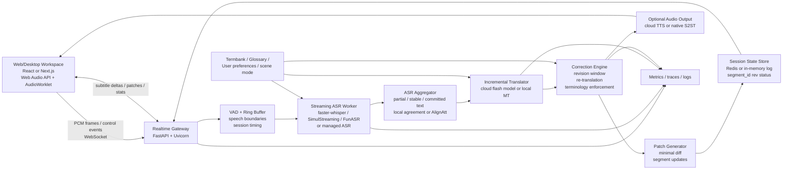
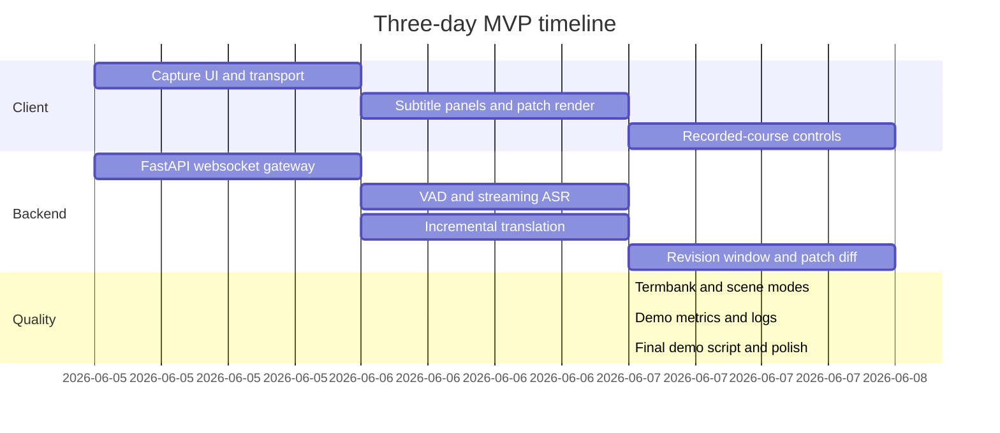

# Technical Architecture for a 2026 AI Simultaneous Interpretation Workspace

## Executive summary

The strongest 2026 systems in this space fall into two product patterns. The first is a **caption-first cascaded pipeline**: streaming ASR, incremental translation, revision-aware correction, and optional TTS. This is how enterprise meeting and subtitle products expose control surfaces such as translated captions, language selection, transcript history, glossaries, and event streams. Zoom’s Video SDK exposes real-time caption/translation events as JSON; DeepL Voice for Meetings runs as a bot-plus-browser-caption workspace with glossary and transcript controls; Google Meet exposes translated captions and now speech translation in near real time; Azure Speech exposes real-time speech-to-text and speech-to-speech translation with multilingual switching. citeturn31view0turn31view1turn31view2turn31view3turn30view4

The second pattern is **native real-time speech translation**. OpenAI now ships a dedicated realtime translation endpoint that returns translated audio and transcript deltas while source audio is still arriving. Alibaba Cloud’s Qwen3.5 LiveTranslate Realtime uses WebSocket, supports multimodal audio/video context, and publicly advertises latency as low as about three seconds. Google’s published Meet/DeepMind work describes an end-to-end real-time speech-to-speech system with roughly two seconds of delay for translated audio in the original speaker’s voice. These systems are excellent when translated audio is the main UX, but they trade off some controllability and portability for speed and product polish. citeturn17search1turn29view4turn29view5turn31view4

For **your product**—users watching talks, tech shares, conferences, and online courses—the best default architecture is **hybrid, caption-first, revision-aware**:
- **Frontend:** React or Next.js for the workspace UI, Web Audio API for capture, WebSocket for transport to your server.
- **Backend:** Python + FastAPI for realtime orchestration, session state, ASR/translation pipelines, and delta patching.
- **Core inference:** streaming ASR plus a small, fast translation/correction layer with a bounded revision window.
- **Optional sidecar:** vendor-native S2ST or cloud TTS if you want spoken Chinese output. citeturn0search1turn23search11turn23search15turn22search2turn30view4

The practical answer to “React/Next.js + Web Audio API + WebSocket **or** Python/FastAPI?” is **both, not either/or**. Browser code is the right place to capture microphone/tab audio and render low-jank subtitles. Python is the right place to manage VAD, ASR state, revision windows, glossaries, and model orchestration. If you deploy the UI on Vercel, keep the realtime WebSocket service separate, because Vercel Functions still do not support persistent WebSocket connections. citeturn23search1turn23search0turn7search10turn22search2

For a **3-day MVP**, the best engineering-demo balance is: **Next.js client + FastAPI realtime gateway + faster-whisper or FunASR for source subtitles + fast cloud translation for Chinese + local-agreement stability + revision-window patches**. For a “wow” demo with the least backend work, use **OpenAI GPT-Realtime-Translate** or **Azure Speech Translation** and wrap them in your own subtitle/revision workspace. For production, keep both modes: a **managed fast path** and a **self-hosted controlled path**. citeturn33view0turn29view3turn29view4turn30view4

## What the best products are doing

The market leaders already show what matters most in practice: low-latency deltas, language controls, transcript continuity, and scene-aware UX. The table below summarizes the product signals worth copying.

| Product or platform | What it exposes | Architectural lesson |
|---|---|---|
| **Google Meet** | Translated captions in the meeting UI; caption customization and scrollback; speech translation now GA for business tiers; Google’s published research describes near-real-time speech-to-speech translation with about 2s delay. citeturn31view2turn31view3turn31view4 | Keep a **subtitle-first workspace** even if you later add translated audio. Users need reviewability and settings. |
| **Zoom Video SDK** | Real-time live transcription and translation as JSON `caption-message` events; speaking-language and translation-language controls; accessibility customization guidance. citeturn31view0 | Build your server and UI around **event streams**, not full-text redraws. |
| **DeepL Voice for Meetings** | Bot joins Teams/Zoom, streams audio, opens a dedicated browser window, supports glossary, transcript download, and meeting history controls. citeturn31view1turn15search4 | A **separate translation workspace** is viable and often cleaner than forcing everything inside the source app. |
| **Azure Speech** | Real-time speech-to-text and speech-to-speech translation, interim and final results, multilingual input switching, live interpreter preserving style/tone, multiple target languages. citeturn30view4 | Enterprise users value **multilingual robustness** and **multiple outputs** more than research novelty. |
| **OpenAI GPT-Realtime-Translate** | Dedicated translation session on `/v1/realtime/translations`, translated audio plus transcript deltas while source audio is still coming in, minute-based pricing. citeturn17search1turn29view4turn6search8 | A **native translation path** is ideal for translated audio or premium mode. |
| **Alibaba Qwen3.5 LiveTranslate Realtime** | WebSocket realtime A/V translation, visual context, 60 languages, as-low-as-3s latency, natural voice output. citeturn29view5 | For webinars and recorded courses with slides/video, **visual context** is strategically important. |

The consistent pattern is that the best systems do **not** treat simultaneous interpretation as “one-shot translation on a stream.” They keep a session model with intermediate state, user controls, and revision behavior. That is exactly why you should design your product around **segments, revisions, and patches**, rather than raw sentence outputs. citeturn31view0turn31view1turn17search1turn30view4

## Recommended architecture

The recommended baseline is a **browser/web workspace + Python realtime orchestration service + pluggable inference backends**. This preserves control over revisions, termbanks, and UI, while letting you swap between open-source and vendor-managed backends depending on cost, privacy, and latency requirements. Browser audio capture belongs on the client through `getUserMedia()` or `getDisplayMedia()`. Custom low-latency audio processing belongs in `AudioWorklet`, which runs on a separate thread. Persistent bidirectional transport between browser and your own backend is best done with **WebSocket**. citeturn23search1turn23search0turn23search15turn7search1turn22search2

For system audio on the web, there is an important product constraint: browser support is uneven. `getDisplayMedia()` can capture a tab or shared screen audio stream, but **entire system audio** depends on OS/browser. Public compatibility notes indicate full system-audio capture is available on Windows and ChromeOS when sharing the full screen, while macOS and Linux are more limited and often only expose tab audio. This is a strong reason to support **microphone mode**, **tab-audio mode**, and **uploaded-file mode** from day one, and optionally move to an Electron or Tauri shell later if full desktop audio capture becomes mission-critical. citeturn23search0turn23search4turn23search13

### Priority architecture



### Why this stack is the right default

A pure Next.js implementation is not enough once you need streaming ASR state, revision windows, buffer trimming, and model orchestration. FastAPI has first-class WebSocket support and is a practical Python control plane for realtime audio and inference workflows. At the same time, Web Audio APIs remain the right place to handle device permissions, capture, local resampling, and visual waveform or latency indicators in the browser. citeturn0search1turn23search11turn23search15

If you want **direct browser-to-model audio sessions**, then the answer changes by provider. OpenAI explicitly recommends **WebRTC** rather than WebSockets for browser and mobile Realtime connections, while recommending WebSocket for server-to-server. Gemini Live is primarily a **stateful WSS** API and also has partner integrations that bridge through WebRTC. That means your own product should support **two transports**: WebSocket to your server for the controlled caption-first path, and WebRTC only for optional direct vendor-native voice modes. citeturn22search1turn22search2turn30view3turn30view0

### Protocol choice

| Protocol | Best use in your product | Why | Main limitation |
|---|---|---|---|
| **WebSocket** | **Default** browser ↔ your backend for audio frames, control messages, subtitle deltas, patches | Bidirectional, binary-friendly, simple to implement alongside FastAPI and model orchestration. OpenAI also recommends it for server-to-server Realtime. citeturn22search2turn0search1 | You own backpressure, heartbeat, reconnect logic, and audio framing. |
| **WebRTC** | Optional browser ↔ vendor-native realtime audio sessions | Best when connecting directly from browser/mobile to realtime voice models; OpenAI recommends WebRTC for browser/mobile Realtime. Google partner paths for Gemini Live also use WebRTC. citeturn22search1turn30view3 | More signaling complexity; less convenient when your own server must inspect every token or patch. |
| **SSE** | Fallback for **server → browser text-only** streaming | Very simple, HTTP-native, auto-reconnect, good for pure subtitle push. MDN explicitly positions SSE as server-push over HTTP. citeturn7search0turn7search4 | One-way only. Not suitable for upstream audio or interactive steering. |

### Latency budget

The budget below is a **target engineering budget**, not a vendor guarantee. It is inferred from public streaming chunk configs, realtime vendor docs, and public faster-whisper throughput benchmarks.

| Stage | Aggressive target | Safer target | Notes |
|---|---:|---:|---|
| Browser capture, resample, frame pack | 20–40 ms | 40–80 ms | `AudioWorklet` is the right primitive for low-latency processing. citeturn23search15 |
| Uplink to gateway | 20–80 ms | 50–150 ms | Region proximity matters most. |
| VAD / speech boundary hysteresis | 60–180 ms | 120–250 ms | Silero VAD is extremely fast on CPU; WebRTC VAD is also lightweight. citeturn5search0turn5search1 |
| ASR partial decode | 120–350 ms | 250–700 ms | FunASR public streaming configs use 480–600 ms granularity; faster-whisper has enough throughput headroom on commodity GPUs for live use. citeturn29view3turn33view0 |
| Incremental translation | 60–180 ms | 120–350 ms | Use a fast flash model or lightweight MT on committed or near-committed text. |
| Patch diff + render | 10–30 ms | 20–50 ms | Keep updates to delta patches, not full re-renders. |
| Optional TTS | 120–300 ms | 250–700 ms | Streaming TTS is feasible with OpenAI and cloud providers. citeturn28search2turn28search6 |
| **Time to first readable subtitle** | **400–900 ms** | **800–1800 ms** | Caption-first path. |
| **Time to committed stable subtitle** | **1200–2500 ms** | **1800–4000 ms** | Bounded revision window. |
| **Translated audio delay** | **~2–3 s** | **3–5 s** | Aligned with published native S2ST claims from Google and Qwen LiveTranslate. citeturn31view4turn29view5 |

### Session and state management

For the MVP, in-memory session state inside the FastAPI gateway is sufficient. For production, move to a small **Redis-backed state layer** with:
- a bounded **audio ring buffer** of about 20–30 seconds,
- a **segment log** keyed by `session_id`,
- current subtitle materialized state keyed by `segment_id`,
- a small **pending-revision window**,
- per-session termbank and scene mode,
- and consumer-group fanout for ASR, translation, and optional TTS workers. Redis Streams are well suited here because they act as append-only logs and support consumer groups for realtime event processing. citeturn8search0turn8search4

A good internal lifecycle is:
`RECEIVED_AUDIO → ASR_PARTIAL → ASR_STABLE → TRANSLATION_PARTIAL → PATCHED → COMMITTED`.
Only the latest few segments remain revisable. Everything older is immutable unless the user explicitly asks for “accuracy mode” on recorded content.

### Suggested wire protocol

Use a small event vocabulary and delta patches instead of redrawing full transcript blocks.

```json
{
  "type": "asr.partial",
  "session_id": "sess_01",
  "segment_id": "seg_1042",
  "rev": 3,
  "start_ms": 128340,
  "end_ms": 130120,
  "source_lang": "en",
  "text": "Today we're going to talk about vector",
  "stability": 0.72,
  "speaker": null
}
```

```json
{
  "type": "translation.patch",
  "session_id": "sess_01",
  "segment_id": "seg_1042",
  "rev": 5,
  "target_lang": "zh-CN",
  "base_rev": 4,
  "patches": [
    {"op": "replace", "from_char": 7, "to_char": 11, "text": "向量"},
    {"op": "insert", "at_char": 13, "text": "数据库"}
  ],
  "reason": "context_revision",
  "stability": 0.91
}
```

```json
{
  "type": "segment.commit",
  "session_id": "sess_01",
  "segment_id": "seg_1042",
  "rev": 6,
  "source_text": "Today we're going to talk about vector databases.",
  "target_text": "今天我们来谈谈向量数据库。",
  "start_ms": 128340,
  "end_ms": 131020,
  "speaker": "spk_1",
  "final": true
}
```

This design matches the way modern realtime systems expose **deltas** rather than final monoliths: OpenAI’s realtime transcription and translation stream transcript deltas; Anthropic streaming uses SSE deltas; Zoom caption events arrive incrementally as JSON. citeturn21search1turn17search1turn18search1turn31view0

## Models and correction strategy

The architecture should optimize for three different jobs, not one:
- **source understanding** through ASR,
- **meaning-preserving target rendering** through MT or a fast LLM,
- **revision control** through stability logic and bounded re-translation.

Trying to solve all three with a single generic model usually increases latency or reduces controllability.

### ASR, VAD, and diarization choices

| Layer | Best self-host choice | Best managed choice | Recommendation |
|---|---|---|---|
| **VAD** | **Silero VAD**: tiny, CPU-fast, well suited to chunking; public docs say under 1 ms for a 30+ ms chunk on one CPU thread. **WebRTC VAD** remains a strong conservative option. citeturn5search0turn5search1 | Usually built into managed speech stacks | Default to **Silero** unless you are targeting telephony/noisy RTC where WebRTC VAD can be a safer conservative gate. |
| **Streaming ASR** | **faster-whisper** for strong multilingual baseline; **SimulStreaming** if you want the most advanced open-source streaming policy; **FunASR** if Chinese or hotwords matter. faster-whisper is built on CTranslate2 and publicly benchmarks much faster than the reference Whisper implementation; SimulStreaming merges Whisper-Streaming and Simul-Whisper; FunASR exposes streaming ASR, hotwords, timestamps, and diarization. citeturn20search15turn33view0turn34view1turn29view3 | **OpenAI GPT-Realtime-Whisper**, **Azure Speech**, **Google Speech-to-Text**, **Amazon Transcribe**. OpenAI and Azure are the cleanest current streaming integrations. citeturn21search1turn21search7turn11search8turn11search1 | For MVP, use **faster-whisper** or **FunASR**. For the best open-source streaming behavior, move to **SimulStreaming** later. |
| **Recorded long-form ASR** | **WhisperX**: word-level timestamps, forced alignment, diarization, strong throughput on long audio. citeturn26search0turn26search12 | **Azure Batch Transcription**, **Google batch recognize**, **Amazon batch transcription**. citeturn16search0turn16search1turn16search2 | For online courses and replayable content, prefer **offline accuracy mode** with larger chunks and alignment. |
| **Diarization** | **pyannote.audio** is the most mature OSS choice; **NeMo Sortformer** is strong for NVIDIA-centered stacks and offers offline and online diarizers. citeturn25search1turn25search4 | **pyannoteAI** if diarization quality is strategic and budget allows; public benchmark pages position it as top-tier and public API marketing claims sub-150ms integration latency. citeturn25search0turn25search5 | Do **not** put diarization on the critical path for one-speaker talks. Run it asynchronously for conference/Q&A mode. |

A few concrete implementation notes matter. Whisper is robust because it was trained on 680,000 hours of multilingual, multitask data, but the base model is **not** designed as a streaming recognizer. Whisper-Streaming showed that a **local-agreement** policy can make it usable in realtime with about 3.3 seconds latency on long-form speech, while Simul-Whisper showed that attention-guided streaming plus truncation detection limits average WER degradation to about 1.46% at 1-second chunks. SimulStreaming is the current open-source continuation and explicitly documents **AlignAtt** as the best-performing 2025 policy, with **LocalAgreement** as the easiest implementation. citeturn20search11turn35view2turn35view3turn34view1

The strongest operational default today is:
- **LocalAgreement** for MVP,
- **AlignAtt / SimulStreaming** for production if you stay open-source,
- **WhisperX** for recorded-course mode,
- **FunASR** when Chinese hotwords, timestamps, and speaker labeling matter more than Whisper compatibility. citeturn34view0turn34view1turn29view3turn26search0

### Translation and optional speech output

| Role | Strongest managed options | Strongest self-host options | Use it when |
|---|---|---|---|
| **Incremental text translation** | **Azure Speech Translation** for speech-native enterprise pipelines; **OpenAI fast text models** for correction-oriented translation; **Gemini Flash/Live** for low-latency multimodal ecosystems; **Alibaba Qwen** for multilingual Asian-market integration. Azure exposes interim and final translation results. OpenAI and Gemini both support streaming and caching patterns. citeturn30view4turn18search3turn30view1turn6search7 | **MarianMT/OPUS**, **M2M100**, **NLLB-200** for self-hosted MT. Marian is efficient C++-heritage MT; M2M100 is many-to-many multilingual; NLLB-200 covers 200 languages. citeturn14search2turn14search3turn20search0turn20search8 | When subtitles are the main UX and you need explicit control over revisions and terminology. |
| **Correction and rewrite layer** | **Claude streaming**, **OpenAI small/flash models**, **Gemini Flash**. Anthropic streams text over SSE; OpenAI supports prompt caching; Gemini exposes streaming and realtime APIs. citeturn18search1turn18search3turn17search3 | **Qwen3**, **Gemma 3**, **Llama 3.2 1B/3B**, **Mistral Small** for local correction. Qwen3 and Gemma 3 are current strong multilingual open models; Llama 3.2 1B/3B explicitly targets lightweight multilingual use cases. citeturn19search0turn19search9turn19search5turn19search6turn19search10 | When you already have ASR text and want fast contextual fixes, disambiguation, and terminology enforcement. |
| **Native speech-to-speech translation** | **OpenAI GPT-Realtime-Translate**, **Azure Live Interpreter / speech translation**, **Qwen3.5 LiveTranslate**, **Google Meet/DeepMind-derived S2ST**. citeturn29view4turn30view4turn29view5turn31view4 | **SeamlessM4T v2**, **StreamSpeech**. SeamlessM4T v2 improves over v1 in quality and speech-generation latency; StreamSpeech is an all-in-one offline and simultaneous S2ST/ASR/ST/TTS model. citeturn20search1turn20search5turn20search10turn20search14 | Only when spoken translated audio is a first-class feature. For subtitle products, this should be optional. |

The key recommendation is simple: **use dedicated MT or a fast small LLM for translation/correction, not a giant general LLM as the only core translator unless you absolutely need complex discourse correction**. Small or flash models are typically enough because the upstream ASR has already done the heavy speech understanding.

### Termbank and terminology control

Terminology is not a nice-to-have in tech talks. It is one of the main quality differentiators. Modern speech and translation stacks already expose the primitives you need:
- **FunASR** supports hotwords in ASR and can emit timestamps and speaker info. citeturn29view3
- **DeepL**, **Google Cloud Translation**, and **Amazon Translate** all expose glossary/custom terminology APIs; Azure Translator supports custom models and terminology workflows. citeturn15search4turn15search2turn15search3turn15search21

In your product, terminology should exist at **three levels**:
- **ASR biasing**: hotwords, expected speaker names, company and product names.
- **MT glossary**: canonical translations, do-not-translate terms, acronym policies.
- **Correction prompt memory**: project-specific termbank and recent topic context.

This matters more in your target scenarios than in generic meeting AI, because users watching technical content are disproportionately sensitive to mistranslated jargon.

### Revision-aware correction strategy

This is the most important part of your differentiator.

The best-practice correction stack is:

1. **ASR stability policy**  
   Use **LocalAgreement** in MVP. It confirms the longest common prefix of two consecutive decodes and commits only that prefix. SimulStreaming describes LocalAgreement this way explicitly and calls it much easier than AlignAtt. citeturn34view1

2. **Translation on stable-plus-revisable context**  
   Translate the newly committed source text plus a **small revision window** behind it, usually the last 1–3 subtitle segments or ~5–12 seconds. This prevents global retranslations and preserves UI stability.

3. **Revision screening**  
   If you ever move to direct simultaneous ST, look at **revision-controllable decoding**. The ASRU 2023 work introduces an allowed revision window during beam pruning to reduce flicker and even eliminate it under tighter settings. citeturn35view0turn35view1

4. **Minimal diffs to UI**  
   Never resend the whole subtitle if only a noun phrase changed. Emit **patches** only. This reduces network overhead, visual flicker, and accidental subtitle “jumping.”

5. **Patch rate as a product metric**  
   Track how often words change after first display. Users feel instability more than they measure BLEU.

This recommendation is not just practical engineering. It is aligned with the simultaneous-translation literature. Google Research’s “re-translation versus streaming” result found that re-translation can match or beat dedicated streaming systems even under limited revision constraints, which strongly supports the use of **small-window re-translation** in a product system. citeturn36search18

### Scene-adaptive strategies

| Scene | What matters most | Recommended strategy |
|---|---|---|
| **Live keynote or lecture** | Low delay, one dominant speaker, readable captions | Disable diarization by default. Use 480–700 ms ASR updates, LocalAgreement, 1–2 segment revision window, large font subtitles. citeturn29view3turn34view0 |
| **Technical share** | Terminology and acronym fidelity | Turn on hotwords and glossary. Keep a slightly larger revision window so compound nouns and acronyms can be fixed when context arrives. citeturn29view3turn15search2turn15search4 |
| **International conference / panel / Q&A** | Multiple speakers, interruptions, higher error risk | Run diarization asynchronously, use speaker labels when confidence is good, and be more conservative about commits to reduce embarrassing corrections. citeturn25search1turn25search4 |
| **Recorded online course** | Accuracy over immediacy | Switch to **accuracy mode**: larger buffers, WhisperX or batch transcription, glossary-heavy translation, seek-aware caching, optional precompute. Cloud providers all expose batch/async transcription paths. citeturn26search0turn16search0turn16search1turn16search2 |

## Deployment, scaling, and operations

### Deployment patterns

| Pattern | What you run | Best for | Trade-off |
|---|---|---|---|
| **All-managed** | Browser UI + thin server + OpenAI/Azure/Google/DeepL-style APIs | Fastest MVP, strongest demo polish | Highest vendor dependence; less control over revision internals |
| **Hybrid** | Self-hosted ASR + managed translation/correction | Best engineering-demo balance | Two control surfaces to operate |
| **Mostly self-hosted** | Self-hosted VAD + ASR + MT + correction; optional cloud TTS | Privacy-sensitive or cost-sensitive scale | Highest operational complexity |

For your challenge and likely first production phase, **hybrid** is the best answer. It keeps the part that determines subtitle stability—ASR and revision logic—under your control, while letting you use fast managed translation or TTS where their operational simplicity is worth it.

### Resource and serving choices

The public faster-whisper benchmarks are useful as a reality check. On an RTX 3070 Ti 8GB, faster-whisper large-v2 publicly reports 13 minutes of audio transcribed in about **1m03s** with FP16 and about **59s** with INT8, and even faster when batching; VRAM is roughly **4.5 GB** in FP16 and **2.9 GB** in INT8 in that benchmark setup. That is **batch throughput**, not streaming latency—but it strongly suggests that a single modern consumer GPU has ample headroom for one or several live sessions if you keep chunk sizes sensible. citeturn33view0

FunASR’s public streaming examples expose chunk settings equivalent to about **480–600 ms** display granularity and include built-in VAD, punctuation, timestamps, and diarization support. For Chinese-heavy or bilingual Asian-market use cases, it is unusually practical. citeturn29view3

### Inference engines and orchestration

| Tool | Best use | Recommendation |
|---|---|---|
| **CTranslate2** | Whisper-family inference, Marian-style MT, efficient CPU/GPU inference, INT8/FP16/AWQ support | **Use by default** for self-hosted Whisper/MT stacks. INT8 and FP16 support are well documented; AWQ is supported on NVIDIA GPUs with compute capability ≥ 7.5. citeturn12search1turn32view2turn32view3turn32view1 |
| **Native Python workers** | MVP and low-QPS pipelines | **Best MVP choice**; lowest integration overhead. |
| **Ray Serve** | Multi-stage Python pipelines with autoscaling and dynamic batching | **Best production orchestrator** when you have ASR, MT, correction, and TTS as separate Python deployments. Ray documents dynamic request batching, response streaming, and autoscaling. citeturn8search18turn8search2turn8search6 |
| **NVIDIA Triton** | High-throughput dedicated model serving | Use when ASR or MT throughput becomes the bottleneck; Triton has documented dynamic batching. citeturn3search4 |
| **vLLM / TensorRT-LLM** | Local LLM correction path at scale | Use if a local LLM rewrite layer becomes hot-path. Both document continuous or in-flight batching for throughput. citeturn12search2turn12search13 |
| **TorchServe** | Legacy PyTorch serving | Not recommended for greenfield systems because the official docs now note limited maintenance. citeturn8search3 |

### GPU, CPU, quantization, and batching

CTranslate2 supports INT8, INT16, FP16, BF16, and 4-bit AWQ, and documents which backends support which compute types on CPU and GPU. For self-hosted ASR, **INT8 on CPU** and **FP16 or INT8 on GPU** are the obvious defaults. In practice:
- **CPU-only fallback** is acceptable for demos and recorded courses.
- **Single GPU** is enough for MVP plus a few concurrent sessions.
- **Batching is good for offline workloads**, but for live subtitle UX you should batch conservatively so you do not inflate first-token delay. citeturn12search0turn32view2turn32view3turn33view0

### Scaling and orchestration

Kubernetes HPA remains the standard way to autoscale stateless deployments based on observed metrics, and Kubernetes has stable GPU scheduling support. If you oversubscribe GPUs, NVIDIA’s GPU Operator documents time-slicing for shared usage. For a multi-stage realtime system, the standard production progression is: Docker Compose for development, then Kubernetes plus either Ray Serve or Triton once traffic becomes real. citeturn8search1turn27search3turn27search7turn8search18

### Evaluation metrics and tooling

| Area | Metric | Tool |
|---|---|---|
| **ASR quality** | WER, CER, WIL | JiWER supports WER/CER-style metrics directly. citeturn13search3turn13search7 |
| **MT quality** | COMET, SacreBLEU | COMET is the stronger modern semantic metric; SacreBLEU remains the reproducible lexical baseline. citeturn14search4turn14search1 |
| **Simultaneous latency** | AL, DAL, optionally ATD | SimulEval supports latency metrics for simultaneous translation; Cherry & Foster formalized Average Lagging; ATD addresses end-of-output delay more explicitly. citeturn13search13turn13search0turn13search12 |
| **Diarization** | DER | pyannote.metrics is the standard OSS toolbox. citeturn25search19 |
| **Product UX** | Time to first subtitle, time to committed subtitle, patch rate, flicker rate, glossary-hit rate, characters-per-second | Build these into your own telemetry. |

### Monitoring and logging

Instrument the gateway and workers with **OpenTelemetry** traces and **Prometheus histograms**. Histograms are the right primitive for latency distributions; OTel Python is mature enough for metrics, logs, and traces; Loki is a good fit for cost-effective log aggregation. At minimum, track:
- `capture_to_asr_partial_ms`
- `asr_partial_to_commit_ms`
- `commit_to_translation_patch_ms`
- `subtitle_patch_count`
- `patch_char_delta`
- queue depths
- worker GPU memory
- provider API latency and error rate. citeturn27search0turn27search12turn27search1turn27search2turn27search6

### Privacy and data governance

Audio capture APIs are restricted to **secure contexts** and come with browser privacy requirements. Your product should make capture scope explicit—microphone, tab audio, or uploaded file—and should minimize storage by default. Keep raw audio buffers ephemeral unless the user explicitly asks to save a session. citeturn23search13turn23search0turn23search1

For managed AI backends, the current public enterprise posture is favorable but provider-specific:
- **OpenAI API**: API data is not used for training by default; enterprise privacy page says business data is not used for training by default. citeturn10search1turn10search0
- **Anthropic commercial products/API**: inputs and outputs are not used for model training by default. citeturn9search1
- **Gemini for Google Cloud**: prompts and responses are not used to train Gemini models. citeturn9search2
- **DeepL**: publicly states texts are not stored or used for training without consent and emphasizes GDPR/SOC 2 controls. citeturn9search3
- **AWS Transcribe**: AI service documentation says inputs/outputs are not shared between customers and exposes opt-out mechanisms for training use. citeturn16search9

If privacy is a product differentiator, the strongest story is still **local-first subtitles with optional cloud translation**. If privacy is absolute, run the full cascade self-hosted.

## Implementation plans

### Best 3-day MVP

The following is the strongest **3-day build path** if you want the best ratio of controllability to demo quality:

- **Client**
  - Next.js or React SPA
  - `getUserMedia()` for microphone
  - `getDisplayMedia({audio:true})` for tab/screen audio when available
  - `AudioWorklet` for resampling to mono 16 kHz PCM
  - WebSocket transport to backend
- **Server**
  - FastAPI + Uvicorn websocket gateway
  - In-memory session state
  - Silero VAD
  - faster-whisper `small`, `medium`, or `distil-large-v3` depending hardware
  - fast cloud translator for zh-CN
  - local-agreement commit logic
  - revision window of last 2 subtitle segments
  - `translation.patch` events to UI
- **Optional**
  - OpenAI or cloud TTS for one-click spoken Chinese playback

This path uses exactly the pieces with the highest public evidence of practicality: browser capture APIs, FastAPI websockets, faster-whisper throughput, and vendor streaming/caching docs. citeturn23search1turn23search0turn0search1turn33view0turn18search3

If your priority is **demo polish over ownership**, replace the ASR+translator core with:
- **OpenAI GPT-Realtime-Translate**, or
- **Azure Speech Translation / Live Interpreter**.  
Then keep your own session UI, patch visualization, glossary panel, and recorded-course mode on top. citeturn29view4turn30view4

### Production target

The production target should be a **dual-mode system**:

- **Controlled subtitle mode**
  - Self-hosted ASR
  - Managed or self-hosted translator
  - Full revision window, termbank, patching, transcript archive
  - Best for lectures, tech talks, courses

- **Premium voice mode**
  - Native S2ST path
  - Optional translated audio output
  - Best for meetings and accessibility users who want to listen rather than read

This dual-mode architecture follows the market: top platforms expose both readable text experiences and increasingly natural translated audio experiences. citeturn31view2turn31view4turn29view4turn29view5

### Suggested milestone plan



### Test inputs and demo scripts

Use **three curated demos**, not one:

**Lecture mode**
- One clear single-speaker English talk clip
- Show first subtitle delay, stable commits, smooth scrollback

**Tech mode**
- One clip with domain terms such as CUDA, Triton, vector database, Kubernetes
- Preload a glossary and show the glossary-hit indicator

**Recorded-course mode**
- One prerecorded clip where you deliberately allow a larger buffer
- Show improved final accuracy, better punctuation, and scrollable past subtitles

For public benchmarking, use **SimulEval** for latency/quality trade-offs and standard ASR/MT metrics on your chosen dev clips. For recorded-course evaluation, WhisperX-style aligned timestamps are especially useful because they let you measure subtitle timing quality in addition to text correctness. citeturn13search13turn26search0turn26search12

### UI integration points

The desktop/web workspace should not look like a generic chat app. It should look like a **listening console**:

- **Center panel**: large Chinese subtitles with subtle patch animation
- **Secondary panel**: source-language transcript, collapsible
- **Top bar**: scene mode (`Talk`, `Tech`, `Conference`, `Course`)
- **Right rail**: glossary/termbank, latency mode toggle, speaker labels when available
- **Bottom rail**: live status, p95 latency, patch count, audio source selector
- **Recorded-course mode**: timeline scrubber, seek-aware prefetch, past subtitle review

The visual rule should be: **partial text can move; committed text should feel stable**. That means changed words should be highlighted quietly rather than causing full-row jumps.

### Recommended message contract for UI and backend

Use these event families:

- `audio.frame`
- `vad.state`
- `asr.partial`
- `asr.stable`
- `translation.partial`
- `translation.patch`
- `segment.commit`
- `speaker.update`
- `stats.tick`
- `session.error`

Every event should carry:
- `session_id`
- `segment_id`
- `rev`
- `start_ms`
- `end_ms`
- `source_lang`
- `target_lang`
- `stability`
- optional `speaker`

That structure aligns well with modern incremental systems: OpenAI’s realtime translation/transcription emit deltas, Anthropic streams incremental events, and Zoom’s LTT model is explicitly event-based. citeturn17search1turn21search1turn18search1turn31view0

### Final recommendation

If you want the most defensible product-engineering architecture in 2026, build this:

- **Web workspace:** React or Next.js
- **Transport:** WebSocket to your backend
- **Realtime backend:** Python + FastAPI
- **VAD:** Silero
- **ASR MVP:** faster-whisper
- **ASR production open-source:** SimulStreaming or faster-whisper plus stronger stability logic
- **Recorded-course mode:** WhisperX or batch STT
- **Translation:** fast cloud translator or compact self-hosted MT
- **Correction:** bounded revision-window retranslation plus delta patching
- **Termbank:** mandatory
- **Optional audio mode:** GPT-Realtime-Translate, Azure Speech, or Qwen LiveTranslate

That architecture is the best fit for your required mix of **speed, low redundancy, revision awareness, and scenario adaptation** because it separates the concerns that matter in real products: capture, stability, translation, correction, and presentation. It also gives you a believable path from a 3-day MVP to a real production system without throwing away your first implementation. citeturn31view0turn30view4turn29view4turn29view5turn34view1turn18search3