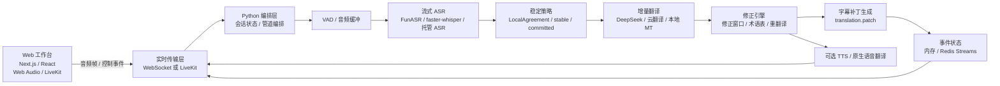

# 2026 AI 同声传译工作台技术架构研究报告

## 执行摘要

面向演讲、技术分享、国际会议和网课的 AI 同声传译产品，最稳妥的路线不是“一边收音频一边整段翻译”，而是 **字幕优先、分段增量、可修正** 的级联管道。成熟产品普遍围绕实时字幕事件、语言控制、转录历史、术语表、补丁更新和会话状态来设计。

当前最值得参考的两类产品形态：

- **字幕优先级联管道**：流式 ASR、增量翻译、可修正字幕、可选 TTS。优点是可控、可审阅、易接术语表，适合技术内容和课程。
- **原生实时语音翻译**：直接返回译文音频和译文文本增量。优点是体验炫，适合语音优先场景；缺点是可控性、修正策略和供应商替换能力较弱。

对 EchoSync 来说，默认架构应采用 **混合式字幕优先方案**：

- 前端：Next.js 或 React 工作台，负责音频采集、字幕渲染和用户控制。
- 传输：默认 WebSocket 到自有后端；若为了 3 天 MVP 降低音频链路复杂度，可以采用 LiveKit/WebRTC。
- 后端：Python 实时编排层，管理 ASR 状态、修正窗口、术语表、会话事件和供应商适配。
- 核心推理：流式 ASR + 快速翻译模型 + 小窗口修正。
- 可选输出：TTS 或供应商原生语音到语音翻译。

当前仓库落地状态：已优先接通 Electron Windows 桌面端的本地 WebSocket/FastAPI 链路。LiveKit/WebRTC 仍是后续可选传输层，不是当前已接通主链路。

## 产品架构原则

### 字幕优先

即使后续加入语音播报，也应保留一个可回看、可修正、可查看原文的字幕工作台。用户看技术内容时，字幕的可读性和术语一致性通常比“听起来像真人”更重要。

### 事件流优先

系统不应反复重绘整段字幕，而应输出小事件：

- `audio.frame`
- `vad.state`
- `asr.partial`
- `asr.stable`
- `translation.partial`
- `translation.patch`
- `segment.commit`
- `speaker.update`
- `stats.tick`
- `session.error`

事件化设计能降低闪烁、减少网络负担，也方便之后接日志、回放、Redis Streams 和指标系统。

### 小窗口修正

实时同传中，前文经常会被后文纠正。最佳实践是只允许最近 1-3 个字幕片段处于可修正状态，旧片段提交后保持稳定。这样既能修正错误，又不会让用户感觉整屏字幕乱跳。

## 推荐架构

### 前端

前端负责用户可见体验：

- 麦克风、标签页音频、文件三种输入模式。
- 大字号中文字幕。
- 原文转写可折叠展示。
- 术语表、场景模式、延迟模式、稳定度指标。
- 对 `translation.patch` 做局部更新，而不是整段替换。

浏览器全系统音频采集存在平台差异：Windows 和 ChromeOS 对屏幕/系统音频支持更好，macOS 和 Linux 常常只能采集标签页或麦克风。因此从第一天就要支持 `mic/tab/file` 三类入口。

### 后端

Python 适合作为实时编排层：

- 管理音频缓冲和 VAD。
- 管理 ASR partial/stable/committed 状态。
- 管理翻译上下文和术语表。
- 管理修正窗口和事件输出。
- 隔离 FunASR、DeepSeek、TTS 等具体供应商。

如果选择 WebSocket 路线，FastAPI + Uvicorn 是自然选择。如果选择 3 天快速路线，LiveKit 可以替代手写 WebRTC/WebSocket 音频链路，但仍应把 LiveKit 限制在传输适配层，不能让核心管道依赖 LiveKit SDK。

## 协议选择

| 协议 | 适用场景 | 优点 | 限制 |
|---|---|---|---|
| WebSocket | 浏览器到自有后端的默认字幕与音频事件通道 | 简单、双向、易与 FastAPI 编排结合 | 需要自己处理心跳、重连、背压、音频帧格式 |
| WebRTC / LiveKit | 需要低延迟音频传输和现成房间能力的 MVP | 省去大量音视频传输细节 | 信令和房间模型更重，核心逻辑要避免被 SDK 绑死 |
| SSE | 服务端到浏览器的文本流兜底 | 简单、自动重连 | 单向，不适合上行音频 |

## 延迟预算

| 阶段 | 激进目标 | 稳妥目标 | 说明 |
|---|---:|---:|---|
| 浏览器采集和封包 | 20-40 ms | 40-80 ms | Web Audio 或 LiveKit 负责采集链路 |
| 上行传输 | 20-80 ms | 50-150 ms | 区域距离和网络质量影响最大 |
| VAD 和边界判断 | 60-180 ms | 120-250 ms | Silero VAD 或供应商内置 VAD |
| ASR partial decode | 120-350 ms | 250-700 ms | FunASR、faster-whisper 或托管 ASR |
| 增量翻译 | 60-180 ms | 120-350 ms | 使用快速云模型或轻量 MT |
| 补丁生成和渲染 | 10-30 ms | 20-50 ms | 只发局部 patch |
| 可选 TTS | 120-300 ms | 250-700 ms | 默认不放在 MVP 首屏关键路径 |
| 首条可读字幕 | 400-900 ms | 800-1800 ms | 字幕优先路径 |
| 稳定提交字幕 | 1200-2500 ms | 1800-4000 ms | 允许小窗口修正 |

## 模型与供应商建议

### ASR

| 方案 | 适用场景 | 建议 |
|---|---|---|
| FunASR | 国内友好、中文/中英混合、热词和时间戳 | MVP 首选之一 |
| faster-whisper | 多语种开源基线、部署自由度高 | 适合自托管 controlled path |
| SimulStreaming | 更强的流式策略和 AlignAtt | 生产阶段再接 |
| WhisperX | 录播课程、离线高准确模式 | 用于 accuracy mode |
| Azure / OpenAI / Google 托管 ASR | 快速演示或企业集成 | 作为 managed fast path |

### 翻译

MVP 可以采用 DeepSeek 这类兼容 OpenAI API 的快速模型。生产阶段可以保留多实现：

- 云模型：低接入成本，适合快速迭代。
- 专用翻译 API：适合术语表、企业稳定性和多语言。
- 本地 MT：适合隐私和成本敏感场景。

不要把一个大模型同时承担 ASR、翻译和修正三件事。更稳的做法是让 ASR、翻译、修正各自承担清晰职责。

### 修正

修正策略应分三层：

1. **ASR 稳定策略**：MVP 用 LocalAgreement 思想，确认连续结果的稳定前缀后再提交。
2. **小窗口重翻译**：只重翻译最近 1-3 个片段，避免全局字幕抖动。
3. **最小补丁输出**：只输出变化字符范围，前端局部更新。

## 术语表

技术分享和课程对术语非常敏感。术语能力应分三层：

- ASR 热词：产品名、人名、技术名词、缩写。
- 翻译术语表：固定译名、保留原文、大小写和缩写策略。
- 修正上下文：把最近主题和术语命中情况传给修正层。

## 场景策略

| 场景 | 关键目标 | 推荐策略 |
|---|---|---|
| 直播演讲 | 低延迟、单说话人、字幕稳定 | 关闭说话人分离，使用较小修正窗口 |
| 技术分享 | 术语准确、缩写一致 | 启用热词和术语表，修正窗口略大 |
| 国际会议 / Q&A | 多说话人、打断、噪声 | 说话人分离异步运行，提交策略更保守 |
| 录播课程 | 准确优先 | 启用 accuracy mode，使用更大缓冲和离线对齐 |

## 部署和扩展

### MVP

- Web：Next 15 工作台。
- 传输：LiveKit 或 WebSocket。
- Agent：Python 原生进程。
- 状态：内存事件总线。
- ASR：FunASR 或 mock。
- 翻译：DeepSeek。
- TTS：默认关闭。

### 生产

- 传输层：WebSocket/FastAPI control plane + 可选 LiveKit。
- 状态层：Redis Streams 或类似事件日志。
- 推理层：按 ASR、翻译、修正、TTS 拆分 worker。
- 指标：首字幕延迟、稳定提交延迟、patch rate、术语命中率、供应商延迟。
- 部署：开发期 Docker Compose，流量上来后 Kubernetes + Ray Serve 或 Triton。

## 三天 MVP 路线

### 第 1 天：通道和工作台

- 建立 Next 15 工作台。
- 接入音频来源选择。
- 建立 LiveKit 或 WebSocket 通道。
- Python Agent 能接收音频帧或 mock 帧。

### 第 2 天：ASR 和翻译

- 接入 FunASR streaming。
- 接入 DeepSeek 翻译。
- 输出 `translation.partial` 和 `segment.commit`。
- 前端展示稳定字幕和未稳定字幕。

### 第 3 天：修正和演示

- 加入 1-2 个片段修正窗口。
- 输出 `translation.patch`。
- 加入术语表示例。
- 展示延迟、稳定度和 patch 计数。

## UI 要点

工作台不应像聊天应用，而应像监听控制台：

- 中心：大字号中文字幕。
- 次级：原文转写，可折叠。
- 顶部：场景模式和音频来源。
- 侧栏：术语表、目标语言、稳定度、延迟。
- 底部：连接状态、patch 数、错误提示。

视觉规则：未稳定文本可以轻微变化，已提交文本必须稳定。

## 最终建议

EchoSync 的长期架构应保持双模式：

- **可控字幕模式**：自托管或可替换 ASR，显式修正窗口，完整字幕事件流，适合课程和技术内容。
- **高级语音模式**：供应商原生语音翻译或 TTS，适合希望直接听中文的用户。

当前仓库应继续沿着“字幕优先、事件驱动、供应商可替换、修正窗口独立”的方向推进。这样既能 3 天内跑通 MVP，又不会在后续真实接模型时推倒重来。
